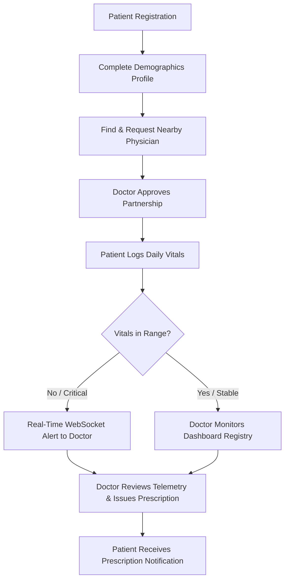

# PulseCare AI: Intelligent Remote Patient Monitoring Platform

PulseCare AI is a production-quality, intelligent Remote Patient Monitoring (RPM) SaaS platform. It connects chronic care patients with primary care physicians to facilitate automated daily vitals tracking, intelligent triage alert dispatching, and digital prescription fulfillment.

---

## 🚀 Product Workflow



---

## 🛠️ Technology Stack

| Layer | Technologies Used |
|---|---|
| **Frontend** | React 19, Vite, Tailwind CSS v4, Redux Toolkit, Axios, React Router v6, React Hook Form |
| **Backend** | Node.js, Express.js, Socket.IO, Express Validator, Winston Logger |
| **Database** | MySQL, Sequelize ORM |
| **Authentication** | JSON Web Tokens (JWT), bcryptjs |

---

## 📂 Architecture Structure & Rationale

PulseCare AI uses an enterprise-ready, layered structure to decouple concerns, enforce clean code boundaries, and scale with multiple teams.

### 🖥️ Frontend Structure (`frontend/src/`)

- **`assets/`**: Static image resources, brand icons, and media files.
- **`components/`**: Divided into `common/` (atomic controls like Buttons, Inputs) and `layout/` (structural headers, footers).
- **`config/`**: Contains [`axiosClient.js`](file:///c:/Users/Dell/OneDrive/Documents/sharpner/PulseCare%20AI/frontend/src/config/axiosClient.js) preset with request interceptors for token injection.
- **`constants/`**: Holds route pathways, error mapping catalogs, and application configs.
- **`context/`**: Wraps providers for theme states, modal events, or notifications.
- **`hooks/`**: Custom React hooks capturing reuse patterns (e.g. `useSocket` listeners).
- **`layouts/`**: Top-level page wrappers separating public pages from authenticated workspace views.
- **`pages/`**: View layouts containing route destinations (e.g. dashboards, logins).
- **`routes/`**: Manages routing paths and route guards (e.g. protecting clinical screens from unauthenticated viewers).
- **`services/`**: Abstracts HTTP server endpoints request definitions.
- **`store/`**: Central Redux Toolkit state stores and feature slices.
- **`utils/`**: Reusable formatter functions for numbers, dates, and conversions.

### ⚙️ Backend Structure (`backend/src/`)

- **`config/`**: Holds database drivers initialization and Winston logging parameters.
- **`constants/`**: Stores static values (roles, triage alert values) to avoid magic strings.
- **`controllers/`**: Intercepts request flows, runs validation checkpoints, and triggers responses.
- **`helpers/`**: Small utility helpers (e.g. age calculations, BMI formulas).
- **`middlewares/`**: Houses central filters like token authentication and global error formatting.
- **`models/`**: Defines Sequelize database schema configurations.
- **`repositories/`**: Isolates direct MySQL access queries from core business routines.
- **`routes/`**: Handles REST routing.
- **`services/`**: Business domain rules engine (e.g., patient vital alert threshold checks).
- **`sockets/`**: Manages real-time WebSockets communication (Socket.IO).
- **`utils/`**: General shared server assets (e.g. ApiResponse formatting wrappers).
- **`validators/`**: Rules defined for express-validator.
- **`logs/`**: Files containing logs from winston for error tracking.

---

## ⚡ Setup & Launch Instructions

### 1. Prerequisites
- **Node.js**: v18+ (tested on v22)
- **MySQL**: Ensure a local instance is running, and create a database named `pulsecare_db`.

### 2. Backend Installation & Start
```bash
# Navigate to backend folder
cd backend

# Install dependencies
npm install

# Setup environment variables
cp .env.example .env

# Run development server
npm run dev
```

### 3. Frontend Installation & Start
```bash
# Navigate to frontend folder
cd ../frontend

# Install dependencies
npm install

# Setup environment variables
cp .env.example .env

# Start dev server
npm run dev
```
The React portal will run on [http://localhost:5173](http://localhost:5173).

---

## 🔑 Shared API Response Architecture

Every API endpoint complies with a standard JSON layout:

#### Successful Responses (`ApiResponse`)
```json
{
  "success": true,
  "statusCode": 200,
  "message": "Resource retrieved successfully",
  "data": {
    "user": { "id": 1, "name": "John Doe", "role": "Patient" }
  }
}
```

#### Failed Responses (`ApiError`)
```json
{
  "success": false,
  "statusCode": 400,
  "message": "Validation failed",
  "errors": [
    { "field": "email", "message": "Email format is invalid" }
  ],
  "data": null
}
```
