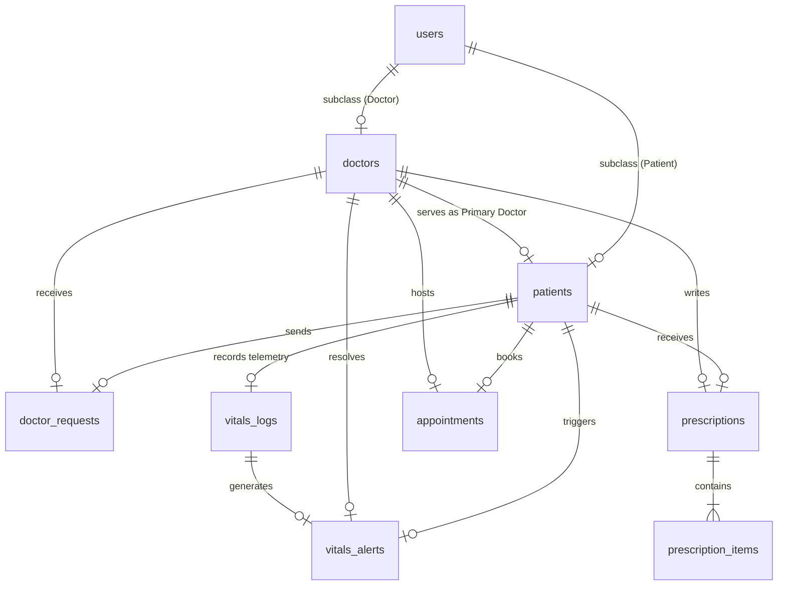

# Database Architecture & Domain Model: PulseCare AI

This document establishes the database architecture and domain models for **PulseCare AI (Intelligent Remote Patient Monitoring Platform)**. It has been designed by a Senior Software Architect and Database Engineer to reflect healthcare compliance, time-series telemetry scaling, and relational consistency.

---

## 1. Domain Analysis

Unlike static CRUD-oriented portals or simple Hospital Management Systems, an **Intelligent Remote Patient Monitoring (RPM) SaaS** is an **event-driven telemetry system**. 

### Core Domain Challenges:
1.  **Identity Separation vs. Unified Auth**: We require a single, centralized identity core (`Users`) for unified JWT token mapping, credentials validation, and role governance. However, the attributes of a `Patient` (DOB, height, blood group) differ fundamentally from a `Doctor` (medical license number, specialization, availability status). Merging them into a single table yields wide, sparse rows and null-pollution.
2.  **Telemetry Data Ingestion**: Daily vitals logs (`VitalsLogs`) are essentially **time-series data**. They represent high-throughput records detailing patient physiological telemetry. This table must support rapid insertions and optimize queries looking for the "latest N records" for clinician panels.
3.  **Intelligent Alerting State Engine**: When vitals limits break safe thresholds, the system must trigger a triage event (`VitalsAlerts`). This alert must be bound directly to a specific vital log and route instantly to the primary doctor. The alerts require lifecycle tracking (`Open` -> `Doctor Reviewing` -> `Resolved` with clinical notes).
4.  **Clinical Governance (Prescriptions)**: A prescription is a legal medical order. Normalizing it requires dividing it into a parent record (`Prescriptions`) representing the encounter context, and line-item details (`PrescriptionItems`) preventing duplicate records or messy array columns.

---

## 2. Entity List

The following 9 core entities represent the schema constraints for Version 1:

1.  **User**: Represents authentication credentials, phone, and role.
2.  **Patient**: Represents demographic profiles, clinical data, and the primary doctor association.
3.  **Doctor**: Represents clinical staff licensing, status, and clinics locations.
4.  **DoctorRequest**: Implements the invitation handshake workflow between patient and doctor.
5.  **VitalsLog**: Captures physiological time-series inputs.
6.  **VitalsAlert**: Signals abnormal values, mapping a state machine for incident resolution.
7.  **Prescription**: Represents the parent clinical encounter context of a medication event.
8.  **PrescriptionItem**: Lists the medication dosage, frequency, and instructions.
9.  **Appointment**: Manages calendar scheduling reservations between patients and doctors.

---

## 3. Table Design

All primary keys use **BIGINT UNSIGNED AUTO_INCREMENT** (or UUIDs) to prevent id exhaustion under telemetry load. Explicit audit fields (`created_at` and `updated_at`) are present on all tables.

### Table 1: `users`
*   **Purpose**: Central credentials, security identity, and auth state.
*   **Columns**:
    *   `id`: `BIGINT UNSIGNED`, Primary Key, Auto-Increment.
    *   `email`: `VARCHAR(191)`, Unique, Not Null.
    *   `password_hash`: `VARCHAR(255)`, Not Null.
    *   `role`: `ENUM('Admin', 'Doctor', 'Patient')`, Not Null.
    *   `phone`: `VARCHAR(20)`, Nullable.
    *   `status`: `ENUM('Active', 'Inactive', 'Suspended')`, Default: `'Active'`.
    *   `created_at`: `TIMESTAMP`, Default: `CURRENT_TIMESTAMP`.
    *   `updated_at`: `TIMESTAMP`, Default: `CURRENT_TIMESTAMP ON UPDATE CURRENT_TIMESTAMP`.

---

### Table 2: `doctors`
*   **Purpose**: Clinic details, licenses, and specialties.
*   **Columns**:
    *   `id`: `BIGINT UNSIGNED`, Primary Key (FK to `users.id`, Cascade on Delete).
    *   `first_name`: `VARCHAR(100)`, Not Null.
    *   `last_name`: `VARCHAR(100)`, Not Null.
    *   `license_number`: `VARCHAR(50)`, Not Null, Unique.
    *   `specialization_id`: `INT UNSIGNED`, Foreign Key, Nullable (Lookup link).
    *   `clinic_name`: `VARCHAR(150)`, Nullable.
    *   `clinic_address`: `VARCHAR(255)`, Nullable.
    *   `clinic_city`: `VARCHAR(100)`, Nullable.
    *   `clinic_state`: `VARCHAR(50)`, Nullable.
    *   `clinic_zip`: `VARCHAR(15)`, Nullable.
    *   `is_available`: `BOOLEAN`, Default: `TRUE`.
    *   `created_at` / `updated_at`: `TIMESTAMP`.

---

### Table 3: `patients`
*   **Purpose**: Demographics and current doctor linking.
*   **Columns**:
    *   `id`: `BIGINT UNSIGNED`, Primary Key (FK to `users.id`, Cascade on Delete).
    *   `first_name`: `VARCHAR(100)`, Not Null.
    *   `last_name`: `VARCHAR(100)`, Not Null.
    *   `date_of_birth`: `DATE`, Not Null.
    *   `gender`: `ENUM('Male', 'Female', 'Other', 'PreferNotToSay')`, Not Null.
    *   `blood_type`: `ENUM('A+', 'A-', 'B+', 'B-', 'AB+', 'AB-', 'O+', 'O-')`, Nullable.
    *   `address`: `VARCHAR(255)`, Nullable.
    *   `city`: `VARCHAR(100)`, Nullable.
    *   `state`: `VARCHAR(50)`, Nullable.
    *   `zip_code`: `VARCHAR(15)`, Nullable.
    *   `primary_doctor_id`: `BIGINT UNSIGNED`, Nullable (FK to `doctors.id`, Set Null on Delete).
    *   `created_at` / `updated_at`: `TIMESTAMP`.

---

### Table 4: `doctor_requests`
*   **Purpose**: Linking handshake workflow state.
*   **Columns**:
    *   `id`: `BIGINT UNSIGNED`, Primary Key, Auto-Increment.
    *   `patient_id`: `BIGINT UNSIGNED`, Not Null (FK to `patients.id`, Cascade on Delete).
    *   `doctor_id`: `BIGINT UNSIGNED`, Not Null (FK to `doctors.id`, Cascade on Delete).
    *   `status`: `ENUM('Pending', 'Accepted', 'Rejected')`, Default: `'Pending'`.
    *   `notes`: `TEXT`, Nullable (Context from patient request).
    *   `resolved_at`: `TIMESTAMP`, Nullable.
    *   `created_at` / `updated_at`: `TIMESTAMP`.

---

### Table 5: `vitals_logs`
*   **Purpose**: Ingested telemetry vital entries.
*   **Columns**:
    *   `id`: `BIGINT UNSIGNED`, Primary Key, Auto-Increment.
    *   `patient_id`: `BIGINT UNSIGNED`, Not Null (FK to `patients.id`, Cascade on Delete).
    *   `heart_rate`: `SMALLINT UNSIGNED`, Not Null (bpm).
    *   `systolic_bp`: `SMALLINT UNSIGNED`, Not Null (mmHg).
    *   `diastolic_bp`: `SMALLINT UNSIGNED`, Not Null (mmHg).
    *   `oxygen_level`: `DECIMAL(5, 2)`, Not Null (Percentage SpO2).
    *   `temperature`: `DECIMAL(4, 1)`, Not Null (Celsius).
    *   `weight`: `DECIMAL(5, 2)`, Nullable (kg).
    *   `logged_at`: `TIMESTAMP`, Default: `CURRENT_TIMESTAMP`.
    *   `triage_status`: `ENUM('Normal', 'Warning', 'Critical')`, Default: `'Normal'`.
    *   `created_at` / `updated_at`: `TIMESTAMP`.

---

### Table 6: `vitals_alerts`
*   **Purpose**: Track abnormal telemetry and resolution tasks.
*   **Columns**:
    *   `id`: `BIGINT UNSIGNED`, Primary Key, Auto-Increment.
    *   `patient_id`: `BIGINT UNSIGNED`, Not Null (FK to `patients.id`, Cascade on Delete).
    *   `vitals_log_id`: `BIGINT UNSIGNED`, Not Null (FK to `vitals_logs.id`, Cascade on Delete).
    *   `doctor_id`: `BIGINT UNSIGNED`, Not Null (FK to `doctors.id`, Cascade on Delete).
    *   `alert_type`: `ENUM('Warning', 'Critical')`, Not Null.
    *   `status`: `ENUM('Open', 'Acknowledged', 'Resolved')`, Default: `'Open'`.
    *   `resolved_at`: `TIMESTAMP`, Nullable.
    *   `resolution_notes`: `TEXT`, Nullable (Doctor's assessment notes).
    *   `created_at` / `updated_at`: `TIMESTAMP`.

---

### Table 7: `prescriptions`
*   **Purpose**: Record of encounters resulting in medical directions.
*   **Columns**:
    *   `id`: `BIGINT UNSIGNED`, Primary Key, Auto-Increment.
    *   `patient_id`: `BIGINT UNSIGNED`, Not Null (FK to `patients.id`, Restrict on Delete).
    *   `doctor_id`: `BIGINT UNSIGNED`, Not Null (FK to `doctors.id`, Restrict on Delete).
    *   `clinical_notes`: `TEXT`, Nullable.
    *   `prescribed_at`: `TIMESTAMP`, Default: `CURRENT_TIMESTAMP`.
    *   `created_at` / `updated_at`: `TIMESTAMP`.

---

### Table 8: `prescription_items`
*   **Purpose**: Medication specifications (line items normalization).
*   **Columns**:
    *   `id`: `BIGINT UNSIGNED`, Primary Key, Auto-Increment.
    *   `prescription_id`: `BIGINT UNSIGNED`, Not Null (FK to `prescriptions.id`, Cascade on Delete).
    *   `medication_name`: `VARCHAR(150)`, Not Null.
    *   `dosage`: `VARCHAR(50)`, Not Null (e.g. "500mg").
    *   `frequency`: `VARCHAR(100)`, Not Null (e.g. "Once daily").
    *   `duration_days`: `SMALLINT UNSIGNED`, Not Null.
    *   `instructions`: `VARCHAR(255)`, Nullable (e.g. "Take after food").
    *   `created_at` / `updated_at`: `TIMESTAMP`.

---

### Table 9: `appointments`
*   **Purpose**: Clinic appointment scheduler bookings.
*   **Columns**:
    *   `id`: `BIGINT UNSIGNED`, Primary Key, Auto-Increment.
    *   `patient_id`: `BIGINT UNSIGNED`, Not Null (FK to `patients.id`, Cascade on Delete).
    *   `doctor_id`: `BIGINT UNSIGNED`, Not Null (FK to `doctors.id`, Cascade on Delete).
    *   `appointment_at`: `TIMESTAMP`, Not Null.
    *   `status`: `ENUM('Scheduled', 'Completed', 'Cancelled', 'NoShow')`, Default: `'Scheduled'`.
    *   `reason`: `VARCHAR(255)`, Nullable.
    *   `notes`: `TEXT`, Nullable.
    *   `created_at` / `updated_at`: `TIMESTAMP`.

---

## 4. Relationships

1.  **User 1:1 Patient** or **User 1:1 Doctor**: Identifies roles in the system. The `id` in both subclass profiles references the parent identity key in `users`.
2.  **Doctor 1:N Patients**: A doctor acts as primary caregiver for many patients.
3.  **Patient 1:N VitalsLogs**: Tracks a patient's historical vitals logs.
4.  **VitalsLog 1:1 VitalsAlert**: A critical vitals log record can trigger at most one alert.
5.  **Doctor 1:N VitalsAlerts** & **Patient 1:N VitalsAlerts**: Clinicians review active alerts associated with patients.
6.  **Prescription 1:N PrescriptionItems**: Normalizes the prescription details by breaking medication line-items out of JSON blobs.
7.  **Patient 1:N Appointments** & **Doctor 1:N Appointments**: Ties calendars together.

---

## 5. Mermaid ER Diagram



---

## 6. Lifecycle Flow

### Step 1: Registration
```
Patient signs up via UI -> Record created in `users` (role='Patient') -> Profile record created in `patients`.
```

### Step 2: Connection Invitation
```
Patient searches doctors near zip code -> Selection -> Record inserted in `doctor_requests` (status='Pending').
```

### Step 3: Clinician Handshake
```
Doctor reviews pending requests -> Approves -> `status` in `doctor_requests` set to 'Accepted' -> `primary_doctor_id` in `patients` updated to matching doctorId.
```

### Step 4: Daily Ingestion & Automated Alerting
```
Patient logs vitals -> Record inserted in `vitals_logs` -> Trigger evaluates thresholds:
  ↳ If abnormal -> `triage_status` set to 'Critical' -> Record created in `vitals_alerts` (status='Open') -> Socket.IO pushes live alert to Doctor's active screen.
```

### Step 5: Incident Resolution & Clinical Encounter
```
Doctor clicks alert -> Resolves alert -> Writes resolution notes -> `status` in `vitals_alerts` updated to 'Resolved'.
Doctor holds video checkup -> Writes prescription -> Row added to `prescriptions` -> Multiple rows added to `prescription_items`.
```

---

## 7. Sequelize Relationships

### `User` Associations
```javascript
User.hasOne(Patient, { foreignKey: 'id', as: 'patientProfile' });
User.hasOne(Doctor, { foreignKey: 'id', as: 'doctorProfile' });
```

### `Patient` Associations
```javascript
Patient.belongsTo(User, { foreignKey: 'id', as: 'user' });
Patient.belongsTo(Doctor, { foreignKey: 'primary_doctor_id', as: 'primaryDoctor' });
Patient.hasMany(VitalsLog, { foreignKey: 'patient_id', as: 'vitalsLogs' });
Patient.hasMany(DoctorRequest, { foreignKey: 'patient_id', as: 'requests' });
Patient.hasMany(VitalsAlert, { foreignKey: 'patient_id', as: 'alerts' });
Patient.hasMany(Prescription, { foreignKey: 'patient_id', as: 'prescriptions' });
Patient.hasMany(Appointment, { foreignKey: 'patient_id', as: 'appointments' });
```

### `Doctor` Associations
```javascript
Doctor.belongsTo(User, { foreignKey: 'id', as: 'user' });
Doctor.hasMany(Patient, { foreignKey: 'primary_doctor_id', as: 'patients' });
Doctor.hasMany(DoctorRequest, { foreignKey: 'doctor_id', as: 'requests' });
Doctor.hasMany(VitalsAlert, { foreignKey: 'doctor_id', as: 'alerts' });
Doctor.hasMany(Prescription, { foreignKey: 'doctor_id', as: 'prescriptions' });
Doctor.hasMany(Appointment, { foreignKey: 'doctor_id', as: 'appointments' });
```

### `VitalsLog` Associations
```javascript
VitalsLog.belongsTo(Patient, { foreignKey: 'patient_id', as: 'patient' });
VitalsLog.hasOne(VitalsAlert, { foreignKey: 'vitals_log_id', as: 'alert' });
```

### `VitalsAlert` Associations
```javascript
VitalsAlert.belongsTo(Patient, { foreignKey: 'patient_id', as: 'patient' });
VitalsAlert.belongsTo(Doctor, { foreignKey: 'doctor_id', as: 'doctor' });
VitalsAlert.belongsTo(VitalsLog, { foreignKey: 'vitals_log_id', as: 'vitalsLog' });
```

### `Prescription` & `PrescriptionItem` Associations
```javascript
Prescription.belongsTo(Patient, { foreignKey: 'patient_id', as: 'patient' });
Prescription.belongsTo(Doctor, { foreignKey: 'doctor_id', as: 'doctor' });
Prescription.hasMany(PrescriptionItem, { foreignKey: 'prescription_id', as: 'items' });

PrescriptionItem.belongsTo(Prescription, { foreignKey: 'prescription_id', as: 'prescription' });
```

### `Appointment` Associations
```javascript
Appointment.belongsTo(Patient, { foreignKey: 'patient_id', as: 'patient' });
Appointment.belongsTo(Doctor, { foreignKey: 'doctor_id', as: 'doctor' });
```

---

## 8. Recommended Indexes

To keep queries fast, we should index the columns that are frequently used in search filters:

1.  **`patients` (`primary_doctor_id`, `zip_code`)**:
    *   *Reason*: Speeds up a doctor fetching their assigned patients list and patients filtering local doctors nearby.
2.  **`vitals_logs` (`patient_id`, `logged_at` DESC)**:
    *   *Reason*: Crucial for real-time dashboards that show the latest vitals trend for a patient.
3.  **`vitals_alerts` (`doctor_id`, `status`)**:
    *   *Reason*: Quick lookup of outstanding/open critical alerts for a doctor's active monitoring screen.
4.  **`appointments` (`doctor_id`, `appointment_at` ASC)**:
    *   *Reason*: Speeds up loading calendar lists for clinical views.

---

## 9. Future Scalability (No Redesign Needed)

Here is how our schema design easily scales for future requirements without requiring database migrations:

*   **Multiple Hospitals/Clinics Support**:
    *   Introduce a `organizations` table.
    *   Add `organization_id` (FK) to `doctors` and `patients` to partition data cleanly.
*   **Multiple Doctors per Patient (Care Teams)**:
    *   Drop `patients.primary_doctor_id`.
    *   Create a join table `care_teams` mapping `patient_id` to `doctor_id` with a `role` attribute (e.g. Primary Physician, Cardiologist, Nurse).
*   **Family Accounts**:
    *   Create a `family_relations` self-join table pointing from a primary `patient_id` to secondary profiles with relationship codes (e.g. Spouse, Child).
*   **Bluetooth/Wearable Integration**:
    *   Add a `source` column to `vitals_logs` (ENUM: `Manual`, `Fitbit`, `AppleWatch`, `BluetoothDevice`).
    *   Create a `device_registries` table linked to `patients` to track device serial numbers.
*   **AI Predictions**:
    *   Create an `ai_predictions` table linked to `vitals_logs`.
    *   AI microservices can write risk projections to this table without altering the core telemetry schemas.

---

## 10. HIPAA & Security Compliance Details

*   **PHI Encryption**: Patient names, DOBs, and addresses should be encrypted at rest using AES-256 keys.
*   **Audit Trail logs**: Create an `audit_logs` table tracking who queried patient data, what was viewed, and when, ensuring compliance with health regulations.
