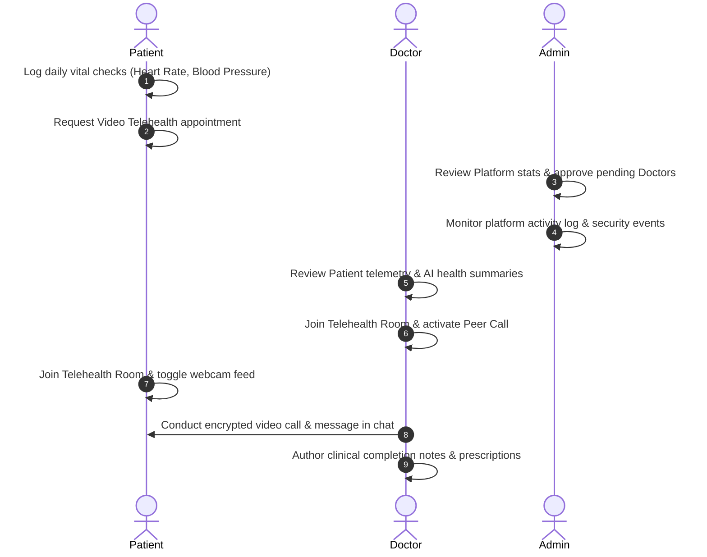

# PulseCare AI - Demo Flow, Roadmap, & Alignment Questions

PulseCare AI is an intelligent remote patient monitoring and telehealth command platform. This document serves as the master guide explaining the complete system demo flows, WebRTC telehealth calling infrastructure, technical roadmaps, and future development alignment questions.

---

## 1. Seeded Credentials & Roster

Use these credentials to login and walk through the flows:

| Role | Username / Email | Password | Role Features |
| :--- | :--- | :--- | :--- |
| **Admin** | `admin@pulsecare.ai` | `Password@123` | Roster directories, doctor verifications, audit trails. |
| **Doctors** | `doctor1@pulsecare.ai` to `doctor10@pulsecare.ai` | `Password@123` | Patients roster, availability controls, telehealth calling. |
| **Patients**| `patient1@pulsecare.ai` to `patient25@pulsecare.ai` | `Password@123` | Vitals logging, appointments booking, AI health summaries. |

---

## 2. Master System Demo Flows

Follow this step-by-step flow to demonstrate the live integration across all roles:



### Flow A: The Patient Journey (Vital Logging & Booking)
1. **Login**: Authenticate as `patient1@pulsecare.ai` (Password: `Password@123`).
2. **Telemetry Logging**:
   - Go to **Vitals Logs** -> **Add New Record**.
   - Input health telemetry (e.g., Systolic: `140`, Diastolic: `90`, Heart Rate: `85`, Weight: `75kg`, Height: `180cm`).
   - Click **Save Record**. The system will automatically calculate the BMI and trigger vital evaluation alarms.
3. **Appointment Scheduling**:
   - Go to **Appointments** -> **Book Appointment**.
   - Choose a Specialist (e.g., Dr. Marcus Vance, Orthopedics).
   - Select a Date and Time Slot, choose **Telehealth Video Call** as type, enter the consultation reason, and confirm the booking.
4. **AI Summary**: Review the **AI Health Summary Card** on the patient home dashboard (which aggregates clinical notes, prescriptions, and alerts into a risk score summary).

### Flow B: The Doctor Journey (Review & Consulting)
1. **Login**: Authenticate as `doctor1@pulsecare.ai` (Password: `Password@123`).
2. **Clinical Review**:
   - Inspect the **Doctor Dashboard** widgets displaying assigned patients, vital alerts, and scheduled consultations.
   - Go to **My Patients** -> Select the patient who recorded vitals. Review their complete visual vital history and graphs.
3. **Telehealth Consultation**:
   - Select the upcoming video appointment from your list.
   - Click the prominent **Join Telehealth Call** button to enter the secure room.
   - Allow camera and microphone access.
   - Click **Simulate Call Feed** to test the call layout (if testing solo). Toggle video/audio tracks or share screen.
   - Use the **Clinical Notepad** tab in the sidebar to write prescriptions and checkups notes live.

### Flow C: The Admin Console (Compliance & Security)
1. **Login**: Authenticate as `admin@pulsecare.ai` (Password: `Password@123`).
2. **Command Metrics**: View real-time platform counts, demographic distributions, and pending approvals.
3. **Management**: Navigate through **Users**, **Doctors**, and **Patients** directories to manage accounts or check active credentials.
4. **Security Logs**: Click on **Settings** (Sidebar) -> **Audit Logs** to view a live audit trail of user logins, IP addresses, registrations, and account verification updates.

---

## 3. Telehealth WebRTC Architecture

PulseCare AI features a production-ready WebRTC Telehealth calling framework:

```
[Local Peer (Camera/Mic Capture)] <====================> [Remote Peer (Camera/Mic Capture)]
       |                                                               |
       +------- (Offer/Answer Description & ICE Candidates Relay) -----+
                                       |
                            [Socket.io Signaling Server]
```

- **Capture Layer**: Uses HTML5 `navigator.mediaDevices.getUserMedia` to capture webcam video/audio tracks.
- **Signaling Layer**: Relays RTC session descriptions (offers/answers) and network ICE candidates in real-time using Socket.io.
- **Peer Connection**: Resolves connection routes directly between peers using Google's public STUN servers, ensuring low latency.
- **Interactive Simulation**: Overlays high-fidelity diagnostic visualizers for testing call layouts without requiring two active users.

---

## 4. Future Implementation Roadmap

To scale this application, here is the recommended roadmap:

1. **Integrated WebRTC Recording**: Support server-side recording of video call consultations (using MediaRecorder API or SFU media servers like Kurento/Mediasoup) to save clinical sessions directly into encrypted cloud buckets.
2. **Dynamic Push Notifications**: Integrate web push alerts (using Web Push protocol) and real-time SMS alerts (using Twilio API) to notify patients and doctors when a telehealth call starts or a vital check alert is triggered.
3. **Advanced AI Co-Pilot**: Integrate Google Gemini/OpenAI API in the backend to parse the doctor's audio recording and automatically generate structured prescriptions, billing codes, and clinical summaries in real-time.
4. **EHR Data Interoperability (FHIR)**: Implement FHIR JSON mapping so patient vitals and telehealth logs can sync directly with EHR systems like Epic or Cerner.

---

## 5. Strategic Questions for the Product Owner

To align on the next development steps, please review the following questions:

> [!QUESTION]
> **1. Production Call Infrastructure**:
> For production deployment, should we continue using direct peer-to-peer (P2P) connections, or should we set up a media server (SFU/MCU like Twilio Video, Daily.co, or Agora) to support multi-party calls and reliable mobile network traversal?

> [!QUESTION]
> **2. Compliance & Privacy (HIPAA)**:
> Since this is a medical application, do you have a preferred hosting provider (e.g., AWS HIPAA-compliant hosting, Aptible) to enforce end-to-end DB encryption, audit trail backups, and secure video archiving?

> [!QUESTION]
> **3. Vitals Logging Integrations**:
> Would you like to connect the Patient Vitals dashboard to popular wearable device APIs (such as Apple HealthKit, Google Fit, or Fitbit) to automatically import vital metrics instead of relying on manual patient inputs?
